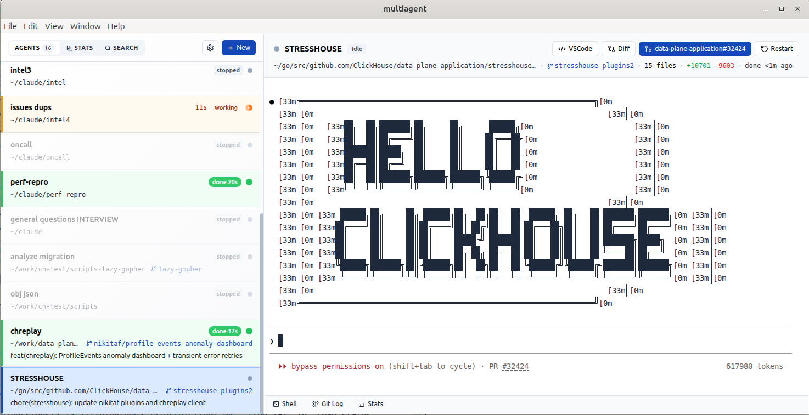

# multiagent-terminal

Run multiple Claude Code agents in parallel. Each agent gets its own git worktree, terminal, and status tracking.

---



## Why

Claude Code in one terminal flickers, can't scroll while it's thinking, gives no signal when it's done, and forgets what you were doing. Run ten of them at once, each in its own git worktree, each with a clean terminal that scrolls and notifies — and stop losing context to the boring stuff.

## Features

- **No flickering** --- unlike raw Claude Code terminal, the UI never flickers or redraws
- **Scroll-safe** --- reading history while agent outputs? Viewport stays put, no scroll hijacking
- **Session persistence** --- agents resume where they left off after app restart via `--continue`
- **Parallel agents** --- spawn unlimited Claude sessions, each in its own git worktree
- **Git worktrees** --- full isolation between agents, no branch conflicts, clean parallel work
- **Live status** --- thinking/working/done detection via PTY output analysis and named pipes
- **Notifications** --- system alerts + green/yellow card highlights when agents finish or are working
- **Terminal per agent** --- full xterm.js with GPU acceleration, scrollback, and bracketed paste
- **Git-aware** --- branch display, file count, line stats (+/-), PR detection, diff viewer
- **Shell tab** --- auxiliary terminal per agent for manual git/shell commands
- **Git log** --- commit history with stats, click to view individual diffs
- **Cross-agent search** --- Ctrl+F across every agent's terminal log, trigram-indexed in a worker thread
- **Token spend dashboard** --- per-agent and aggregate cost/usage with daily charts
- **Cross-platform** --- Linux, macOS, Windows (named pipes adapt per OS)
- **Scope** --- only [Claude Code](https://docs.claude.com/en/docs/claude-code) and [GitHub](https://github.com/) are supported. Other AI agents (Cursor, Gemini CLI, etc.) and other Git hosts (GitLab, Bitbucket) are not — status tracking parses Claude's statusline, PR detection goes through `gh`.

## Install

### Prebuilt (Linux)

Download from the [latest release](https://github.com/ClickHouse/multiagent-terminal/releases/latest):

- **AppImage** — `chmod +x multiagent-terminal-*.AppImage && ./multiagent-terminal-*.AppImage`
- **Debian/Ubuntu** — `sudo dpkg -i multiagent-terminal_*_amd64.deb`

### From source

```bash
git clone https://github.com/ClickHouse/multiagent-terminal.git
cd multiagent-terminal
npm install
npm run dev
```

### Requirements

The app checks these on startup and won't launch without them:

| Command | What for |
|---------|----------|
| `git` | Worktree creation, diff, log |
| `gh` | PR detection, open in browser |
| `claude` | The agents themselves |
| `claude auth` | Must be authenticated |

## Dev

```bash
npm run dev      # electron-vite dev server with HMR
npm run build    # production build to out/
npx electron . --no-sandbox   # run the built bundle without packaging
npm run dist:linux            # produce AppImage + .deb in release/
npm run dist:mac              # macOS dmg
npm run dist:win              # Windows nsis installer
```

## How it works

### Each agent is isolated

```
your-repo/                    # base repository
your-repo-agent-1/            # worktree for agent 1
your-repo-agent-2/            # worktree for agent 2
your-repo-fix-auth/           # worktree for agent 3
```

Agents don't interfere with each other. Each gets a branch, a working directory, and a Claude process.

### Status detection

The status state machine tracks what each agent is doing without polling Claude:

```
idle ---(Enter)--> thinking ---(200B output)--> working ---(3s silence)--> idle
                       |                                                    ^
                       +-----------(60s timeout)----------------------------+
```

A named pipe (`mkfifo` on Unix, `\\.\pipe\` on Windows) receives JSON status updates from Claude's statusline, providing model name, context usage, and cost.

### What you see

| State | Card | Border | Badge |
|-------|------|--------|-------|
| **Idle** | Default | Blue (if selected) | --- |
| **Thinking/Working** | Amber tint | Amber | `working` / `thinking` |
| **Done** | Green tint | Green | `done 12s` |
| **Error/Stopped** | Default | --- | `error` / `stopped` |

Done cards stay green until you click them. The selected card flashes green briefly then fades back. Active cards glow amber. Everything is instant --- no transition animations.

## Stack

| Layer | Tech |
|-------|------|
| App shell | Electron |
| UI | React + TypeScript |
| Build | electron-vite (Vite) |
| Terminal | xterm.js + WebGL addon |
| State | Zustand |
| Persistence | electron-store |
| Git | simple-git |
| PTY | node-pty |
| Diff | diff2html |

## Settings

| Setting | Default | Description |
|---------|---------|-------------|
| Font size | 13 | Terminal font size |
| Scroll speed | 3 | Scroll sensitivity (Alt = 3x) |
| Max lines | 20000 | Terminal scrollback buffer |
| Bright agents | 7 | How many recent agents stay at full opacity (older ones fade) |
| `--dangerously-skip-permissions` | On | Disable to make Claude prompt for tool permissions |
| Resume on open | On | Pass `--continue` when starting agents |
| System notifications | Off | Alert when agent finishes |
| DevTools | Off | Chrome DevTools on startup |

## License

Apache 2.0 — see [LICENSE.md](LICENSE.md).
